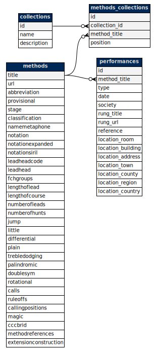

# Data and Copyright

You should assume that the output generated by this application is open for use or copying free-of-charge for any purpose. The purpose of creating it is so that it will be useful to bellringers everywhere.

## Database overview

Only the current version of the data for each entity is retained; no record is kept of when data was created or modified (that information may be available at source). The data is stored in four tables — `collections`, `methods`, `methods_collections`, and `performances`.

The table relationships are shown in the diagram below (source: [`assets/images/database.dot`](../assets/images/database.dot)):

## Methods

Method details are derived from the Central Council of Church Bellringers (CCCBR) data maintained at [methods.cccbr.org.uk](http://methods.cccbr.org.uk). The [XML schema (part 6)](https://cccbr.github.io/methods-library/method_xml_1.0.pdf) has been mapped into the `methods` database table in an obvious way.

Data has not been modified, but the following additional fields have been computed or manually added:

| Field | Description |
|---|---|
| `methods.notationExpanded` | Place notation converted to a normalised format: 0–9 and uppercase letters for places, `x` for changes with no places made, `.` to separate consecutive changes with places made, and any palindromic abbreviations expanded. See [`src/Helpers/PlaceNotation.php`](../src/Helpers/PlaceNotation.php). |
| `methods.url` | The method's name with URL-unsafe/reserved characters removed and converted to the ASCII character set. |
| `methods.abbreviation` | Manually curated abbreviations for methods where the auto-generated abbreviation is not ideal or clashes with common usage. Overrides are in [`src/Resources/data/method_extras_abbreviations.php`](../src/Resources/data/method_extras_abbreviations.php). |
| `methods.nameMetaphone` | The [metaphone key](https://en.wikipedia.org/wiki/Metaphone) of the method's name, used for spell-check in search. |
| `methods.magic` | An integer used to sort methods in an order approximating popularity/commonality, calculated from variables such as whether the method is in a standard collection, its classification, and how commonly peals are rung. |
| `methods.calls` | Details of common calls (Bobs and Singles) for the method. Auto-generated by default, but manually overridden where common practice differs (e.g. Stedman Triples uses Bobs of `5:6:-3` and Singles `567:6:-3`). |
| `methods.callingPositions` | Call position naming conventions used when displaying calls in compositions and method details. Manually set where required. |
| `methods.ruleOffs` | Where lines should be drawn to divide the method into sections when displaying, in the format `[divisionLength]:[start]`. Defaults to `[leadLength]:0` unless manually overridden (e.g. Stedman divided into sixes by `6:-3`). |

You can see how the database is populated in the [`src/Helpers/MethodXMLIterator.php`](../src/Helpers/MethodXMLIterator.php) helper file, and the [`src/Entity/Method.php`](../src/Entity/Method.php) entity.

Manual overrides for calls, rule-offs, and calling positions are in [`src/Resources/data/method_extras_calls.php`](../src/Resources/data/method_extras_calls.php). Comments and corrections are welcome.

## Collections

Collection data has been added manually and is based on common practice in change-ringing. The data is in [`src/Resources/data/collections.php`](../src/Resources/data/collections.php).

## Performances

Performance data (the date and location of the first towerbell and handbell peals of each method, where known) is sourced from the CCCBR data. The [XML schema (part 7)](https://cccbr.github.io/methods-library/method_xml_1.0.pdf) has been mapped into the `performances` table in an obvious way.

Renamed methods are also stored in the `performances` table (with `type = 'renamedMethod'`) using data from [`src/Resources/data/method_renamed.php`](../src/Resources/data/method_renamed.php), turn sourced [from here](https://framework.cccbr.org.uk/version1/amendedmethodtitles.html).
